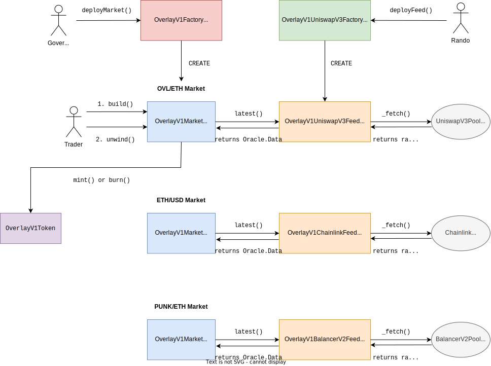

# v1-core

V1 core smart contracts


## Diagram




## Modules

V1 core relies on three modules:

- [Markets Module](#markets-module)
- [Feeds Module](#feeds-module)
- [OVL Module](#ovl-module)


### Markets Module

Traders interact directly with the market contract to take positions on a data stream. Core functions are:

- `build()`
- `unwind()`
- `liquidate()`
- `update()`

Traders transfer OVL collateral to the market contract to back a position. This collateral is held in the market contract until the trader unwinds their position when exiting the trade. OVL is the only collateral supported for V1.

The market contract tracks the current open interest for all outstanding positions on a market as well as [information about each position](./contracts/libraries/Position.sol), that we need in order to calculate the current value of the position in OVL terms:

```
library Position {
  struct Info {
      uint256 leverage; // discrete initial leverage amount
      bool isLong; // whether long or short
      uint256 entryPrice; // price received at entry
      uint256 oiShares; // shares of total open interest attributed to this position on long/short side, depending on isLong value
      uint256 debt; // total debt associated with this position
      uint256 cost; // total amount of collateral initially locked; effectively, cost to enter position
  }
}
```

For each market contract, there is an associated feed contract that delivers the data from the data stream. The market contract stores a pointer to the `feed` contract that it retrieves new data from, and the market uses its `update()` function to retrieve the most recent price and liquidity data from the feed through a call to `IOverlayV1Feed(feed).latest()`. This call occurs every time a user interacts with the market.

All markets are implemented by the contract `OverlayV1Market.sol`, regardless of the underlying feed type.


### Feeds Module

The feed contract ingests the data stream directly from the oracle provider and formats the data in a format consumable by any market contract. The feed contract is limited to a single core external view function

- `latest()`

and an internal view function

- `_fetch()`

which is implemented differently for each specific oracle type. When adding support for a new type of oracle, developers must create a new feed contract that inherits from `OverlayV1Feed.sol` and implement the internal function `_fetch()` to properly integrate with the oracle provider (e.g. Uniswap V3, Chainlink, Balancer V2).

View data returned by `latest()` is formatted as specified by `Oracle.Data`:

```
library Oracle {
    struct Data {
        uint256 timestamp;
        uint256 microWindow;
        uint256 macroWindow;
        uint256 priceOverMicroWindow;
        uint256 priceOverMacroWindow;
        uint256 reserveOverMicroWindow; // in ovl
        uint256 reserveOverMacroWindow; // in ovl
    }
}
```
from the [`Oracle.sol`](./contracts/libraries/Oracle.sol) library. `Oracle.Data` data is consumed by each deployment of `OverlayV1Market.sol` for traders to take positions on the market of interest.

For each oracle provider we support, there should be a specific implementation of a feed contract that inherits from `OverlayV1Feed.sol` (e.g. [`OverlayV1UniswapV3Feed.sol`](./contracts/feeds/uniswapv3/OverlayV1UniswapV3Feed.sol) for Uniswap V3 pools).


### OVL Module

OVL module consists of an ERC20 token with permissioned mint and burn functions. Upon initialization, markets must be given permission to mint and burn OVL to compensate traders for their PnL on positions.


## Deployments

The process to add a new market is as follows:

1. Deploy a feed contract for the data stream we wish to offer a market on. Developers inherit from [`OverlayV1Feed.sol`](./contracts/fees/OverlayV1Feed.sol) to implement a feed contract for the specific type of oracle provider they wish to support if it hasn't already been implemented (e.g. [`OverlayV1UniswapV3Feed.sol`](./contracts/feeds/uniswapv3/OverlayV1UniswapV3Feed.sol) for Uniswap V3 pools). The feed contract ingests the data stream directly from the oracle provider and formats the data in a form consumable by the market

2. Deploy an [`OverlayV1Market.sol`](./contracts/OverlayV1Market.sol) contract referencing the previously deployed feed from 1 as the `feed` constructor parameter. Traders interact directly with this market contract to take positions out. The market contract stores the active positions and open interest for all outstanding trades on the data stream.

3. Grant the newly deployed market contract mint and burn privileges on the sole instance of the [`OverlayV1Token.sol`](./contracts/OverlayV1Token.sol) token. This will be accomplished through a market deployer contract (not yet implemented), which is granted admin privileges on the OVL token by governance.


## Edge Cases

Edge cases need to be thought through:

- Do we make `OverlayV1Market.sol::feed` an immutable storage variable? If so (as it currently is), would mean we need to deploy a new market every time we'd like to upgrade a feed. If not, governance can deploy an upgraded feed and point the market's `feed` variable to that new address, but there are potential issues here around interfering with live trading we need to think through.
